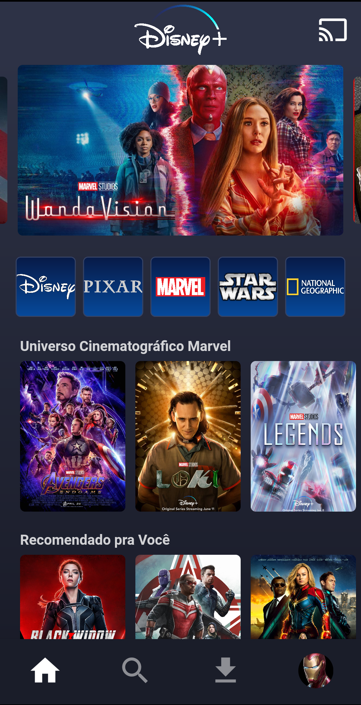
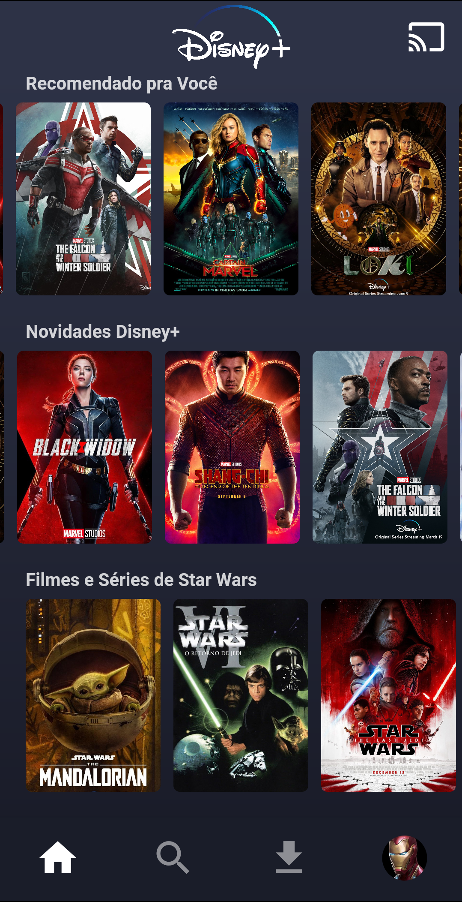
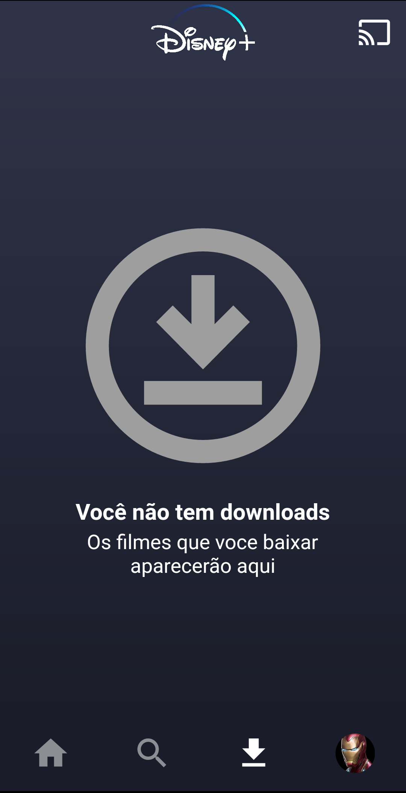

# Disney Plus Clone
Aplicativo criado para estudo de novas funcionalidades do Flutter utilizando o App da Disney+ como base.

***

 

 
 
 
 

  <a href="https://drive.google.com/u/0/uc?id=1jSAwYIXhdV6nVcZsUPWJvUVR8XKdggEj&export=download">Download Disney+ Clone App</a>

### Download do Aplicativo (APK)
Faça o download do arquivo APK do app no Google Drive e instale-o em seu smartphone para teste.

## O que aprendi / utilizei neste projeto

* Melhoria na organização e arquitetura
* Utilização de widgets dinâmicos.
* Metodos de lista como `.map` `.toList`.
* Componentização
* Utilização de Carrosel Slider.
* Utilização de Positioned.
* Utilização de BottomNavigationBar.
* Utilização de ListView.builder.
* Utilização da LinearGradient.
* Utilização de Image Network.
* Utilização de SafeArea.